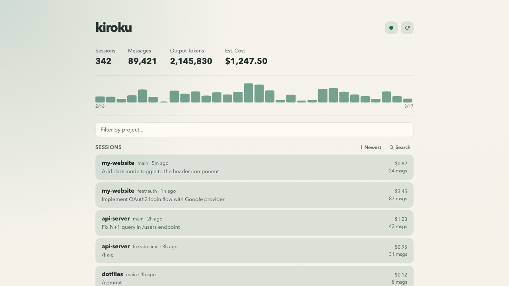

# kiroku

A web dashboard for browsing Claude Code session history. "Kiroku" (記録) means "record" in Japanese.



## Why kiroku?

The more you use Claude Code, the harder it gets to answer "how much am I actually using it?" kiroku reads the JSONL transcripts Claude Code already saves locally and turns them into a visual dashboard.

- **Cost awareness** — See token usage and estimated cost at a glance. Catch overuse early
- **Usage trends** — Daily activity chart shows when and how much you used Claude Code
- **Cross-project overview** — See how sessions are distributed across projects and branches
- **Session search** — Filter by project, branch, model, or date range to find past conversations
- **Agent & skill tracking** — See which Agent subagent types and skills were used in each session
- **Session resume** — Resume any session you find in the dashboard with a single command

No extra setup required — just install and run `kiroku open`. Everything runs locally with no external services.

## Installation

```
make install
```

Installs the `kiroku` binary to `$GOBIN` (or `$GOPATH/bin` if `$GOBIN` is not set).

## Usage

```
kiroku <command> [options]
```

### `open`

Start the web dashboard and open it in a browser. The index is automatically refreshed every 2 seconds while running.

```
kiroku open [--port 4319] [--no-open]
```

| Option    | Default | Description                  |
|-----------|---------|------------------------------|
| `-port`   | `4319`  | Listen port                  |
| `-no-open`| `false` | Skip opening the browser     |

### `doctor`

Check configuration paths and data health.

```
kiroku doctor
```

Example output:

```
config root: /Users/you/.config/claude
stats-cache.json: present
project roots: /Users/you/.config/claude/projects
jsonl files: 42
index db: present
last indexed: 2026-03-16T12:00:00Z
broken lines: 0
```

### `reindex`

Rebuild the session index from JSONL transcript files.

```
kiroku reindex [--full]
```

By default, only files changed since the last run are re-indexed. Use `-full` to drop all data and rebuild from scratch.

### `resume`

Resume a Claude Code session by ID. Runs `claude --resume <session-id>` in the session's original working directory.

```
kiroku resume <session-id>
```

## Build

```
make build    # Build to .build/kiroku
make test     # Run tests
make clean    # Remove build artifacts
```

## Requirements

- Go 1.26.1+
- SQLite (pure Go via modernc.org/sqlite, no CGO required)

## License

MIT
