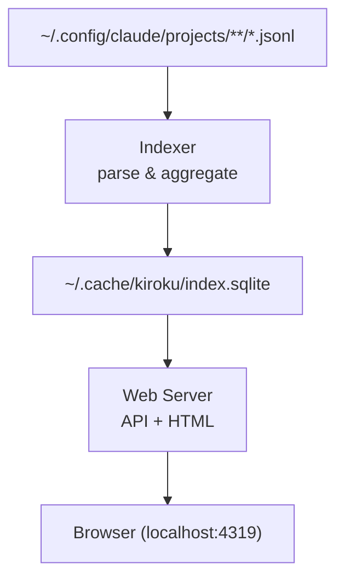

# kiroku

A web dashboard for browsing Claude Code session history.

Parses JSONL transcript files stored under `~/.config/claude/projects/` and provides a Web UI for viewing session lists, token usage, tool usage statistics, and more.

## Installation

```
make install
```

Installs the `kiroku` binary to `$GOBIN` (or `$GOPATH/bin` if `$GOBIN` is not set).

## Usage

```
kiroku <command> [options]
```

### `open`

Start the web dashboard and open it in a browser. The index is automatically refreshed every 2 seconds while running.

```
kiroku open [--port 4319] [--no-open]
```

| Option    | Default | Description                  |
|-----------|---------|------------------------------|
| `-port`   | `4319`  | Listen port                  |
| `-no-open`| `false` | Skip opening the browser     |

### `doctor`

Check configuration paths and data health.

```
kiroku doctor
```

Example output:

```
config root: /Users/you/.config/claude
stats-cache.json: present
project roots: /Users/you/.config/claude/projects
jsonl files: 42
index db: present
last indexed: 2026-03-16T12:00:00Z
broken lines: 0
```

### `reindex`

Rebuild the session index from JSONL transcript files.

```
kiroku reindex [--full]
```

By default, only files changed since the last run are re-indexed. Use `-full` to drop all data and rebuild from scratch.

### `resume`

Resume a Claude Code session by ID. Runs `claude --resume <session-id>` in the session's original working directory.

```
kiroku resume <session-id>
```

## Data Flow



## API Endpoints

| Method | Path | Description |
|--------|------|-------------|
| GET | `/` | Dashboard HTML |
| GET | `/api/summary` | Summary statistics |
| GET | `/api/sessions` | Session list (cursor pagination) |
| GET | `/api/sessions/:id` | Session detail |
| GET | `/api/sessions/:id/messages` | Session messages |
| GET | `/api/projects/summary?cwd=...` | Per-project statistics |
| POST | `/api/reindex` | Rebuild the index |
| GET | `/healthz` | Health check |

## Build

```
make build    # Build to .build/kiroku
make test     # Run tests
make clean    # Remove build artifacts
```

## Requirements

- Go 1.26.1+
- SQLite (pure Go via modernc.org/sqlite, no CGO required)

## License

MIT
